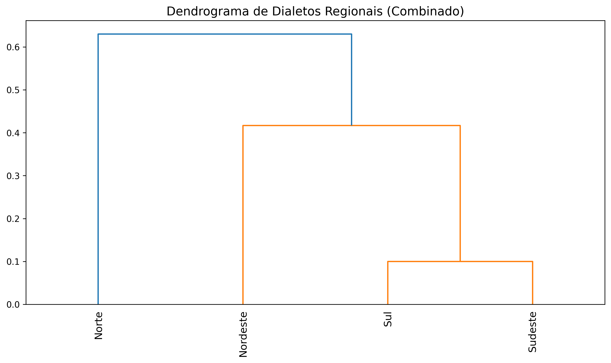
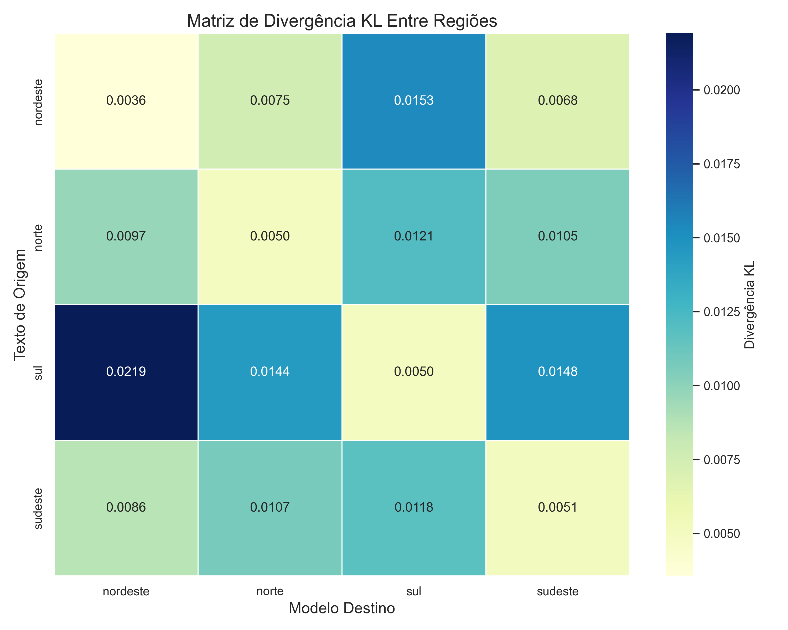
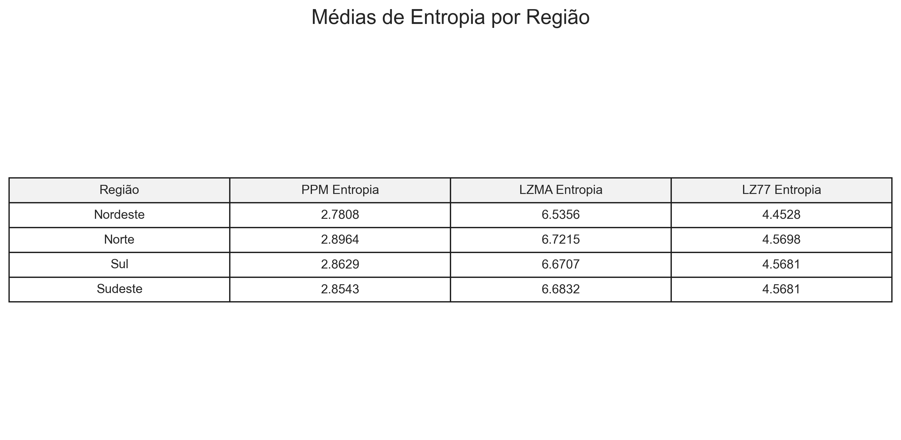
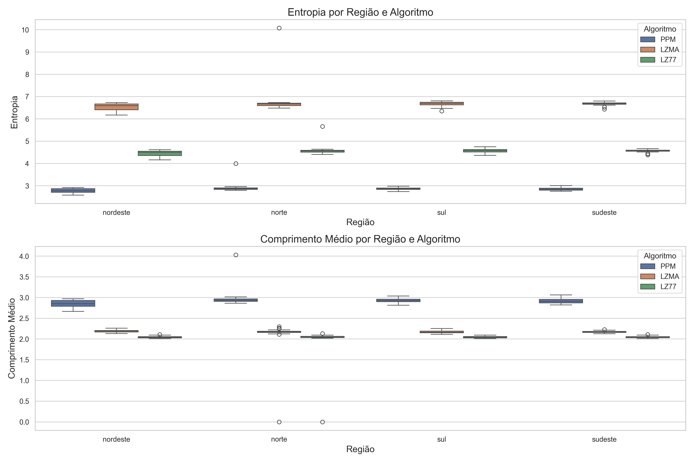

# Estudo e Classificação de Dialetos Regionais Brasileiros

<p align="center">
  
</p>

[](https://opensource.org/licenses/MIT)
[](https://www.python.org/downloads/)
[](https://pt.wikipedia.org/wiki/Processamento_de_linguagem_natural)

> **Uma abordagem inovadora para análise de dialetos brasileiros utilizando algoritmos de compressão de texto para identificar, classificar e visualizar padrões linguísticos regionais.**

*[Read this in English](./README.md)*

## 📋 Índice

- [Visão Geral](#-visão-geral)
- [Dataset](#-dataset)
- [Autores por Região](#-autores-por-região)
- [Metodologia](#-metodologia)
- [Análises](#-análises)
- [Objetivos](#-objetivos)
- [Requisitos](#-requisitos)
- [Uso](#-uso)
- [Resultados](#-resultados)

## 🔍 Visão Geral

Este projeto analisa e classifica dialetos de quatro regiões do Brasil utilizando técnicas de compressão de texto como método de análise linguística. Ao aproveitar a teoria da informação e algoritmos de compressão, podemos identificar padrões estatísticos específicos de cada dialeto regional sem necessidade de engenharia de características linguísticas explícitas.

## 📚 Dataset

- **Composição**: Textos literários com forte presença de regionalismos
- **Divisão**: Conjuntos de treino, teste e validação, 100k caracteres por batch
- **Pré-processamento**: Dados limpos e organizados por região
- **Escopo**: Obras de autores contemporâneos e não contemporâneos que evidenciam ou simulam dialetos regionais

## 👥 Autores por Região

### Nordeste
- Maria Valéria Rezende
- Ariano Suassuna
- Patativa do Assaré
- Bráulio Bessa
- Jarid Arraes
- Itamar Vieira Junior
- Raquel de Queiroz

### Sul
- Luis Fernando Verissimo
- Josue Guimaraes
- Leticia Wierzchowski
- Simoes Lopes Neto
- Paulo Leminski
- Dalton Trevisan
- Cruz e Souza

### Sudeste
- Paulo Lins
- Machado de Assis
- Guimaraes Rosa
- Monteiro Lobato
- Cornéllio Pena
- Oswaldo de Andrade
- Fernanda Torres

### Norte
- Milton Hatoum
- Edyr Augusto
- Dalcídio Jurandir
- Marcio Souza
- Thiago Mello
- Marcia Kambeba

## 🔬 Metodologia

Aplicamos diferentes algoritmos de compressão para analisar as características linguísticas dos textos:

- **PPM (Prediction by Partial Matching)**: Algoritmo principal do estudo
- **Lempel-Ziv (LZ77, LZMA)**: Compressores baseados em dicionário
- **BWT (Burrows-Wheeler Transform)**: Transformação de texto para análise de padrões

<p align="center">
  
</p>

## 📊 Análises

- Cálculo de taxa de compressão por região
- Medição de entropia de textos regionais
- Construção de matrizes de distância entre dialetos
- Geração de dendrogramas para visualização de similaridades
- Comparação de padrões linguísticos entre regiões

## 🎯 Objetivos

- Quantificar diferenças linguísticas entre dialetos regionais
- Identificar características distintivas de cada região
- Estabelecer relações de similaridade entre diferentes dialetos
- Contribuir para estudos linguísticos sobre variações dialetais no Brasil
- Criar um modelo computacional para classificação de dialetos

## 💻 Requisitos

- Python 3.6+
- NumPy
- Bibliotecas de compressão (lzma, zlib)
- Ferramentas de visualização para dendrogramas

## 🚀 Uso

1. Execute a análise de dialetos regionais usando o algoritmo PPM:

```python
from compression_analysis import PPMCompressor
from dialect_utils import load_regional_texts

# Carrega amostras de texto regionais
regional_texts = load_regional_texts(data_path="dataset/", regions=["Nordeste", "Norte", "Sul", "Sudeste"])

# Inicializa o compressor PPM
ppm_compressor = PPMCompressor(order=5)

# Calcula taxas de compressão para cada região
region_metrics = {}
for region, texts in regional_texts.items():
    compressed_sizes = [ppm_compressor.compress(text) for text in texts]
    entropy = ppm_compressor.calculate_entropy(texts)
    region_metrics[region] = {
        "compression_ratio": sum(compressed_sizes) / sum(len(t) for t in texts),
        "entropy": entropy
    }
    
print("Métricas de dialetos regionais:", region_metrics)
```

2. Gere matriz de distância entre dialetos regionais:

```python
from distance_metrics import calculate_kl_divergence
import numpy as np
import pandas as pd

# Calcula divergência KL entre regiões
regioes = ["Nordeste", "Norte", "Sul", "Sudeste"]
n_regioes = len(regioes)
matriz_distancia = np.zeros((n_regioes, n_regioes))

for i, regiao1 in enumerate(regioes):
    for j, regiao2 in enumerate(regioes):
        if i != j:
            matriz_distancia[i, j] = calculate_kl_divergence(
                regional_texts[regiao1], 
                regional_texts[regiao2], 
                ppm_compressor
            )

# Cria e salva matriz de distância
df = pd.DataFrame(matriz_distancia, index=regioes, columns=regioes)
df.to_csv("results/matriz_distancia.csv")
```

3. Visualize dialetos regionais com agrupamento hierárquico:

```python
from dialect_visualization import plot_dendrogram, plot_heatmap
from scipy.cluster.hierarchy import linkage

# Gera matriz de ligação para agrupamento hierárquico
matriz_ligacao = linkage(matriz_distancia, method='ward')

# Plota e salva dendrograma
plot_dendrogram(
    matriz_ligacao, 
    labels=regioes,
    title="Agrupamentos de Dialetos Regionais Brasileiros",
    filename="results/dendrograma_dialetos.png"
)

# Plota e salva heatmap
plot_heatmap(
    matriz_distancia,
    labels=regioes,
    title="Matriz de Distância de Dialetos Regionais",
    filename="results/heatmap_dialetos.png"
)
```

## 📈 Resultados

Os resultados incluem:
- Taxas de compressão por região
- Matrizes de distância entre dialetos
- Visualizações de dendrogramas
- Análises estatísticas de características linguísticas

<p align="center">
  
  <br>
  <em>Dendrograma mostrando o agrupamento hierárquico das regiões brasileiras baseado em modelos de compressão combinados</em>
</p>

<p align="center">
  
  <br>
  <em>Heatmap da divergência de Kullback-Leibler entre dialetos regionais</em>
</p>

<p align="center">
  
  <br>
  <em>Comparação de métricas de entropia entre regiões usando diferentes algoritmos de compressão</em>
</p>

<p align="center">
  
  <br>
  <em>Distribuição de métricas de compressão entre as regiões brasileiras</em>
</p>

## 📄 Licença

Este projeto está licenciado sob a Licença MIT - veja o arquivo LICENSE para detalhes.

## 🤝 Agradecimentos

Agradecimentos especiais a todos os autores cujas obras contribuem para este estudo linguístico e à comunidade de pesquisa em linguística computacional. 