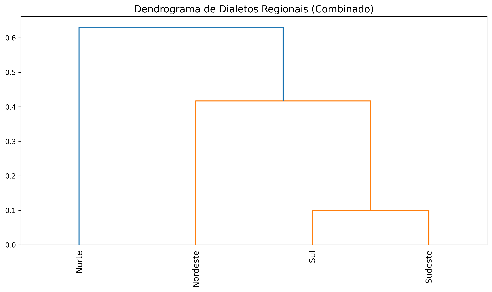
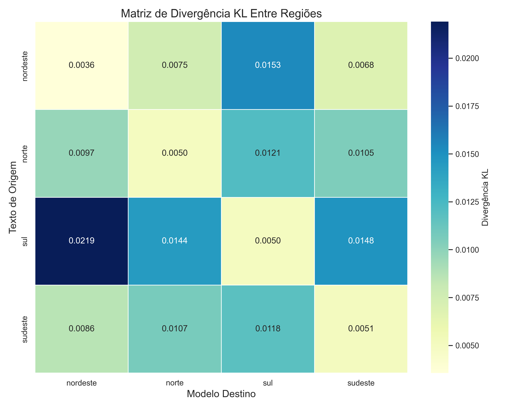

# Brazilian Regional Dialect Classification Study


[](https://opensource.org/licenses/MIT)
[](https://www.python.org/downloads/)
[](https://en.wikipedia.org/wiki/Natural_language_processing)

> **A novel approach to Brazilian dialect analysis using text compression algorithms to identify, classify, and visualize regional linguistic patterns.**

*[Read this in Portuguese](./PTBR.md)*

## 📋 Table of Contents

- [Overview](#-overview)
- [Dataset](#-dataset)
- [Featured Authors](#-featured-authors)
- [Methodology](#-methodology)
- [Analysis](#-analysis)
- [Objectives](#-objectives)
- [Requirements](#-requirements)
- [Usage](#-usage)
- [Results](#-results)

## 🔍 Overview

This project analyzes and classifies dialects from four Brazilian regions using text compression techniques as a method of linguistic analysis. By leveraging information theory and compression algorithms, we can identify statistical patterns specific to each regional dialect without requiring explicit linguistic feature engineering.

## 📚 Dataset

- **Composition**: Literary texts with strong regional linguistic characteristics
- **Division**: Training, testing, and validation sets, 100k characters per batch
- **Pre-processing**: Clean data organized by region
- **Scope**: Works from contemporary and non-contemporary authors that highlight or simulate regional dialects

## 👥 Featured Authors

### Northeast (Nordeste)

- Maria Valéria Rezende
- Ariano Suassuna
- Patativa do Assaré
- Bráulio Bessa
- Jarid Arraes
- Itamar Vieira Junior
- Raquel de Queiroz

### South (Sul)

- Luis Fernando Verissimo
- Josue Guimaraes
- Leticia Wierzchowski
- Simoes Lopes Neto
- Paulo Leminski
- Dalton Trevisan
- Cruz e Souza

### Southeast (Sudeste)

- Paulo Lins
- Machado de Assis
- Guimaraes Rosa
- Monteiro Lobato
- Cornéllio Pena
- Oswaldo de Andrade
- Fernanda Torres

### North (Norte)

- Milton Hatoum
- Edyr Augusto
- Dalcídio Jurandir
- Marcio Souza
- Thiago Mello
- Marcia Kambeba

## 🔬 Methodology

We apply different compression algorithms to analyze the linguistic characteristics of the texts:

- **PPM (Prediction by Partial Matching)**: Primary algorithm of the study
- **Lempel-Ziv (LZ77, LZMA)**: Dictionary-based compressors
- **BWT (Burrows-Wheeler Transform)**: Text transformation for pattern analysis

<p align="center">
  
</p>

## 📊 Analysis

- Calculation of compression rates by region
- Measurement of entropy in regional texts
- Construction of distance matrices between dialects
- Generation of dendrograms for similarity visualization
- Cross-regional linguistic pattern comparison

## 🎯 Objectives

- Quantify linguistic differences between regional dialects
- Identify distinctive characteristics of each region
- Establish similarity relationships between different dialects
- Contribute to linguistic studies on dialectal variations in Brazil
- Create a computational model for dialect classification

## 💻 Requirements

- Python 3.6+
- NumPy
- Compression libraries (lzma, zlib)
- Visualization tools for dendrograms

## 🚀 Usage

1. Run the regional dialect comparison using PPM algorithm:

```python
from compression_analysis import PPMCompressor
from dialect_utils import load_regional_texts

# Load regional text samples
regional_texts = load_regional_texts(data_path="dataset/", regions=["Northeast", "North", "South", "Southeast"])

# Initialize PPM compressor
ppm_compressor = PPMCompressor(order=5)

# Calculate compression ratios for each region
region_metrics = {}
for region, texts in regional_texts.items():
    compressed_sizes = [ppm_compressor.compress(text) for text in texts]
    entropy = ppm_compressor.calculate_entropy(texts)
    region_metrics[region] = {
        "compression_ratio": sum(compressed_sizes) / sum(len(t) for t in texts),
        "entropy": entropy
    }
    
print("Regional dialect metrics:", region_metrics)
```

2. Generate distance matrix between regional dialects:

```python
from distance_metrics import calculate_kl_divergence
import numpy as np
import pandas as pd

# Calculate KL divergence between regions
regions = ["Northeast", "North", "South", "Southeast"]
n_regions = len(regions)
distance_matrix = np.zeros((n_regions, n_regions))

for i, region1 in enumerate(regions):
    for j, region2 in enumerate(regions):
        if i != j:
            distance_matrix[i, j] = calculate_kl_divergence(
                regional_texts[region1], 
                regional_texts[region2], 
                ppm_compressor
            )

# Create and save distance matrix
df = pd.DataFrame(distance_matrix, index=regions, columns=regions)
df.to_csv("results/distance_matrix.csv")
```

3. Visualize regional dialects with hierarchical clustering:

```python
from dialect_visualization import plot_dendrogram, plot_heatmap
from scipy.cluster.hierarchy import linkage

# Generate linkage matrix for hierarchical clustering
link_matrix = linkage(distance_matrix, method='ward')

# Plot and save dendrogram
plot_dendrogram(
    link_matrix, 
    labels=regions,
    title="Brazilian Regional Dialect Clusters",
    filename="results/dialect_dendrogram.png"
)

# Plot and save heatmap
plot_heatmap(
    distance_matrix,
    labels=regions,
    title="Regional Dialect Distance Matrix",
    filename="results/dialect_heatmap.png"
)
```

## 📈 Results

The results include:

- Compression rates by region
- Distance matrices between dialects
- Dendrogram visualizations
- Statistical analyses of linguistic characteristics

<p align="center">
  
  <br>
  <em>Dendrogram showing hierarchical clustering of Brazilian regions based on combined compression models</em>
</p>

<p align="center">
  
  <br>
  <em>Heatmap of Kullback-Leibler divergence between regional dialects</em>
</p>

<p align="center">
  
  <br>
  <em>Comparison of entropy metrics across regions using different compression algorithms</em>
</p>

<p align="center">
  
  <br>
  <em>Distribution of compression metrics across Brazilian regions</em>
</p>

## 📄 License

This project is licensed under the MIT License - see the LICENSE file for details.

## 🤝 Acknowledgments

Special thanks to all the authors whose works contribute to this linguistic study and to the research community in computational linguistics.
